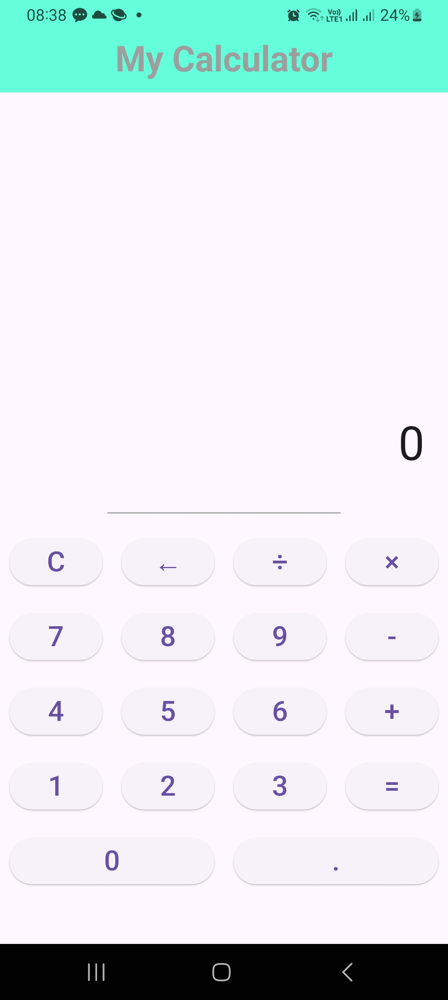
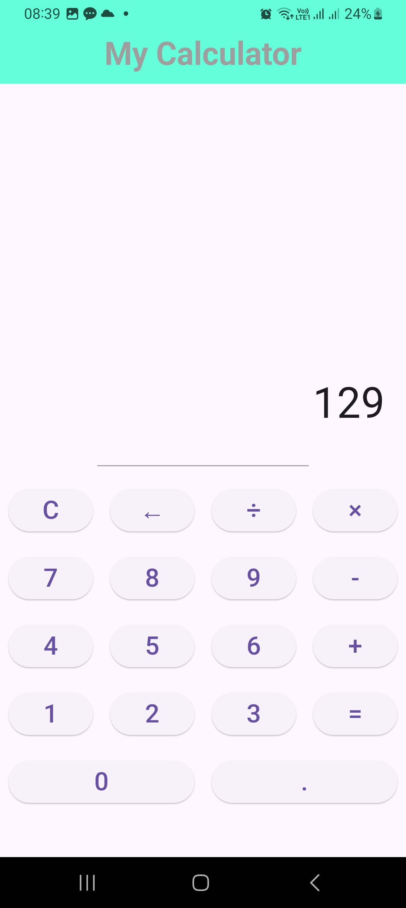

# 🧮 My Calculator - Flutter App

**My Calculator** is a simple calculator application built using Flutter and Dart. This app performs basic arithmetic operations like addition, subtraction, multiplication, and division.

## 📱 Screenshots

<div style="display: flex; justify-content: space-between;">
  
  
</div>

## ✨ Features

- **Basic Arithmetic Operations**: Perform addition, subtraction, multiplication, and division
- **Clear Input**: Reset the current input and start over
- **Backspace**: Delete the last entered character
- **Responsive Layout**: The app adjusts to different screen sizes
- **Prevent Division by Zero**: Safeguard against division by zero, displaying infinity

## 🚀 Installation

1. **Clone the Repository**:
```bash
git clone https://github.com/yourusername/calculator-app.git
```

2. **Navigate to the Project Directory**:
```bash
cd calculator-app
```

3. **Install Dependencies**:
```bash
flutter pub get
```

4. **Run the App**:
```bash
flutter run
```

## 🏗️ Code Structure

- `main.dart`: The main file that sets up the application and UI
- The `MyApp` widget sets up the structure of the app and its home screen
- The `Calculator` widget manages the calculator's input and handles user interactions

**Calculator Logic**:
- `buttonPressed()`: Handles all button presses from the calculator interface
- `performCalculation()`: Handles the actual arithmetic calculations based on user input

## 🎨 UI Components

- **Buttons**: The calculator consists of buttons for digits (0–9), operators (+, -, ×, ÷), and utility functions (C, ←, =)
- **Display Screen**: Shows the current input or result of the arithmetic operation
- **Layout**: A responsive layout using Flutter's `Column`, `Row`, and `Expanded` widgets to ensure a smooth user experience

## 📖 How to Use

1. Enter numbers using the on-screen buttons
2. Perform calculations by pressing the operator buttons (`+`, `-`, `×`, `÷`)
3. Press `=` to get the result
4. Press `C` to clear the input
5. Use `←` to delete the last character in the input
6. Avoid dividing by zero; the app will return `Infinity` if you attempt this

## 🛠️ Dependencies

- **Flutter**: The framework used for building this app
- **Dart**: The programming language used
- **Material Design**: Flutter's material design components are used for the UI

## 📄 License

This project is licensed under the MIT License - see the [LICENSE](LICENSE) file for details.

## 🤝 Contributing

Contributions are welcome! 